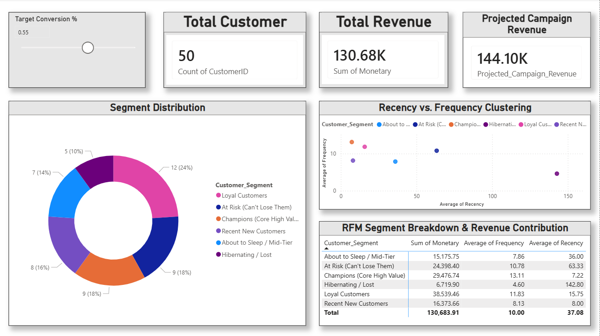

# Customer Value (RFM) Segmentation Engine

## Project Overview
This project is an end-to-end data analytics pipeline designed to categorize customers based on their purchasing behavior using the **RFM (Recency, Frequency, Monetary)** model. 

## Tech Stack
* **Data Ingestion & Processing:** Python (Pandas, Requests, Datetime)
* **Database & Aggregation:** Oracle SQL
* **Data Visualization & Analytics:** Power BI, Advanced DAX

## Pipeline Architecture
1. **Mock API Ingestion:** Python script generates and processes JSON-like transaction payloads to simulate real-world e-commerce extraction.
2. **RFM Scoring Algorithm:** Calculated behavior percentiles (Quantiles 1-5) to group customers into actionable business segments (e.g., *Champions, At Risk, Loyal*).
3. **Relational Database Storage:** Processed data loaded into Oracle SQL for backend storage and aggregation testing.
4. **Executive Dashboard:** Interactive Power BI report featuring "What-If" DAX parameters to simulate projected revenue recovery from targeted marketing campaigns.

## Dashboard Preview

## Business Impact
* Identified **Champions** contributing to high-frequency revenue.
* Highlighted the **At-Risk** segment, allowing marketing teams to design targeted re-engagement campaigns and prevent revenue leakage.
